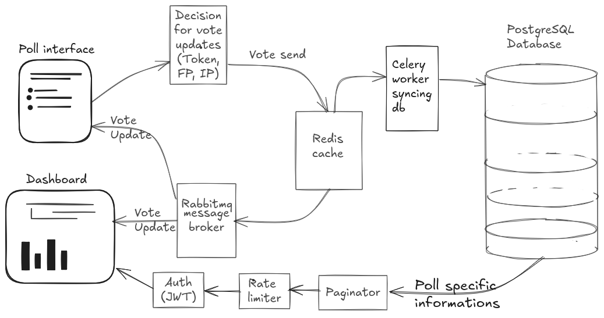

# Architecture

*Figure: High-level architecture of the polling system*

This system is designed to handle high-frequency voting with low latency
while maintaining consistency with a persistent database.

It uses Redis for fast writes, RabbitMQ for messaging,
and Celery workers for asynchronous database synchronization.

## Components

- Backend API (FastAPI)
- Redis (temporary vote storage and counters)
- RabbitMQ (message broker for real-time updates)
- Celery Worker (background processing)
- PostgreSQL (persistent storage)

## Vote Flow

1. User submits a vote via Poll Interface
2. Backend validates vote using:
   - Token
   - Fingerprint (FP)
   - IP address

3. Vote is written to Redis:
   - Fast, atomic updates
   - Prevents DB bottleneck

4. Redis publishes update to RabbitMQ

5. RabbitMQ sends message to:
   - Dashboard (real-time updates)
   - Celery Worker

6. Celery Worker processes:
   - Syncs vote data to PostgreSQL

## Read Flow

1. Dashboard requests poll data
2. Data fetched from PostgreSQL
3. Processed via paginator
4. Returned to client

## Security & Control

- JWT authentication for users
- Rate limiter prevents abuse
- Vote uniqueness enforced via:
  - Token
  - Fingerprint
  - IP tracking